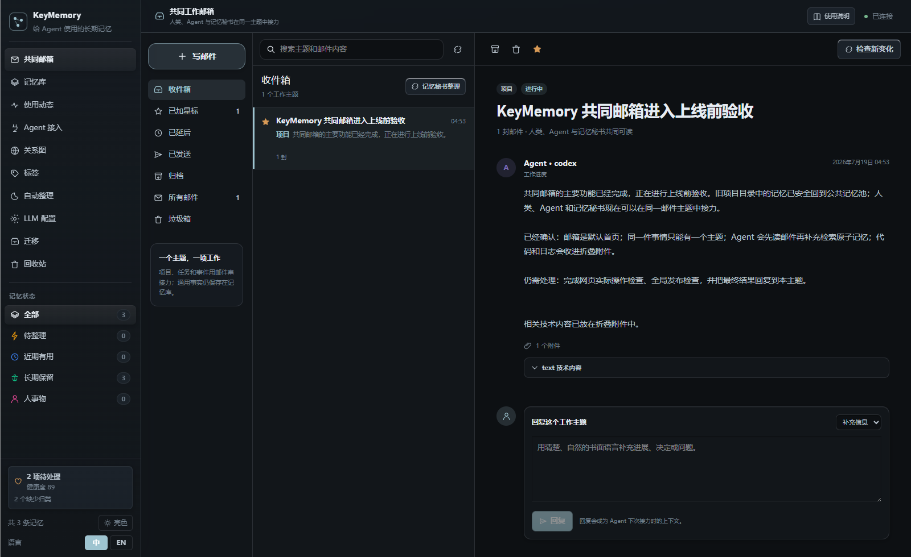

# KeyMemory

> 给人类和 Agent 共用的一间本地记忆办公室。

KeyMemory 是一个本地优先的 Agent 记忆插件和 MCP 服务。它把具体项目、任务和事件整理成一封封持续回复的工作邮件，让人类和 Agent 在同一个主题里看见背景、进展、决定、问题和下一步；同时保留独立的记忆库，用来保存可以跨事情复用的偏好、规则、事实和经验。

它不连接 Gmail 或 Outlook，也不会读取真实邮件。这是 KeyMemory 内部模拟出来的共同工作邮箱。



## 为什么用邮箱承载项目上下文

传统的“项目文件夹”擅长存放文件，却不擅长说明一件事情是怎样一步步发展到今天的。目录名也常常只有“飞书”“前端”“测试”几个字，既不像一项工作，也无法告诉 Agent 应该从哪里接力。

邮箱是大多数人已经熟悉的工作方式：

- 一项具体工作对应一个清楚的邮件主题。
- 新进展继续回复原邮件，不反复建立相似主题。
- 人类可以补充背景、纠正信息、提出问题或确认决定。
- Agent 在执行过程中写回进度、结果、阻碍和下一步。
- “记忆秘书”检查关联记忆，去重后只在确有新变化时补充摘要邮件。
- 人类和 Agent 读到的是同一份书面上下文，接力不依赖某个聊天窗口。

KeyMemory 不会主动唤醒 Agent。邮件只会留在收件箱中，等 Agent 下一次被调用时主动读取。未调用邮箱能力时，记忆秘书也可以按宿主约定的时间整理，但不会启动任何 Agent。

## 产品结构

### 共同邮箱：具体工作的完整经过

Web UI 默认进入共同邮箱，交互结构与常见邮箱一致：写邮件、收件箱、星标、延后、已发送、归档、所有邮件和垃圾箱。

每个邮件主题只代表一个明确的项目、任务或事件。例如：

- 好标题：`飞书文档同步还需要解决权限问题`
- 好标题：`KeyMemory 共同邮箱进入上线前验收`
- 不合格标题：`飞书`
- 不合格标题：`项目`

邮件正文必须使用自然、通俗、适合人阅读的书面语言。代码、日志、JSON、报错堆栈、硬件输出和内部技术细节会作为折叠附件呈现，不能挤占正文。

### 记忆库：可以跨事情复用的原子信息

偏好、约束、人物、工具、事实、流程和经验仍然作为独立记忆保存。具体项目进展不再依靠一级一级的文件夹归集，而是通过邮件主题串联。

同一条记忆可以同时支持多个邮件主题，系统只建立引用，不复制内容。例如“发布前必须完成回归测试”既可以关联产品发布邮件，也可以关联客户端升级邮件。

### 记忆秘书：整理信息，不代替 Agent

记忆秘书负责：

- 检查邮件主题关联的记忆是否发生变化；
- 跳过已经写进邮件的重复内容；
- 把新变化整理成人类能直接读懂的工作邮件；
- 把技术证据放进折叠附件；
- 将摘要回复到原主题。

记忆秘书不执行项目任务，也没有唤醒 Agent 的能力。

## Agent 必须遵守的邮箱协议

KeyMemory 会把下面的规则写入 MCP 工具说明、自动生成的 Agent 规则包、接入提示词和 Context Pack。新接入的 Agent 不需要依赖人工口头解释。

1. 开始或恢复一个具体项目、任务、事件时，先调用 `memory_inbox_list` 查找相关主题。
2. 找到主题后，调用 `memory_thread_context` 读取当前情况、最近回复、未完成事项和关联记忆，再制定方案。
3. 只有确认不存在相关主题，而且事情明确需要持续跟进时，才调用 `memory_thread_create`。
4. 同一件事情只能有一个主题；后续变化调用 `memory_thread_reply` 写回原邮件。
5. 回复应说明有意义的进展、结果、阻碍、决定、问题或下一步，不能只写“已完成”“处理中”。
6. 标题与正文使用自然的书面语言，不使用 AI 模板话，不把代码、日志或结构化数据直接塞进正文。
7. 通用偏好、规则、事实和经验继续写入原子记忆；需要成为项目依据时，用 `memory_thread_link_memory` 关联邮件。
8. `memory_mailbox_sync` 只让记忆秘书检查变化，不会唤醒其他 Agent。
9. 严格遵守 `agent_space`，不得把其他 Agent 的私有记忆附加到无权访问的主题。

完整协议见 [共同邮箱与 Agent 使用协议](docs/mailbox.md)。

## 其他核心能力

- 本地 SQLite：数据默认只保存在本机，服务默认监听 `127.0.0.1`。
- 混合检索：SQLite FTS5 全文检索、本地语义检索和记忆关系扩展。
- 时间有效性：`validFrom / validTo` 保留事实变化的历史，`memory_supersede` 让新事实可信地取代旧事实。
- 自动整理：去重、关联补全、长期化、归档和可回滚报告；项目聚类已不再生成新的用户项目树。
- Loop Harness：长期任务具备租约、幂等断点、版本控制、事件游标、预算与熔断保护。
- 安全备份：迁移和整体恢复前自动备份；普通记忆自动脱敏，工具凭据单独加密保存。
- 多 Agent 接入：支持 Claude Code、Claude Desktop、Codex、Hermes、OpenClaw、OpenCode、WorkBuddy、TRAE 及其他 MCP 兼容 Agent。

## 快速开始

### 环境要求

- Node.js 20+
- pnpm
- Git

### 安装

```bash
git clone https://github.com/digibeing1001/KeyMemory.git
cd KeyMemory
pnpm setup
keymemory doctor
```

### 启动界面

```bash
keymemory dashboard
```

浏览器会打开 `http://127.0.0.1:3210`。默认首页就是共同邮箱；记忆库、最近工作集、Agent 接入、关系图、自动整理、迁移和回收站位于左侧导航。

### 接入 Agent

在 Web UI 打开“Agent 接入”，选择自动连接、命令连接或规则包连接。系统会保留宿主已有配置和个人规则，并在修改前创建备份。

也可以生成配置：

```bash
keymemory agent-config all
keymemory agent-config codex --mode skill
keymemory agent-config openclaw --format json
node install-default-memory.js --all
```

接入完成后必须验证三件事：

1. 配置检测：页面能识别宿主配置。
2. 读取验证：Agent 能调用 `keymemory_connection_status` 和 `memory_inbox_list`。
3. 写入验证：Agent 能在一封真实工作邮件中回复，并重新读回。

### 迁移旧记忆

先预览，不写入：

```bash
keymemory onboard
```

确认后执行：

```bash
keymemory onboard --yes --run-dream --agent-target all
```

支持 Markdown、JSON、JSONL、NDJSON 和文本文件。写入前自动创建备份。旧项目文件夹不会被机械转换成邮件；其中的记忆会回到公共记忆池，后续只在出现真实项目、任务或事件时建立合适的邮件主题。

## 邮箱 MCP 工具

| 工具 | 用途 |
| --- | --- |
| `memory_inbox_list` | 列出当前 Agent 可见的收件箱和工作主题 |
| `memory_thread_create` | 为一项明确工作建立唯一邮件主题 |
| `memory_thread_read` | 读取完整往来和折叠附件，并标记已读 |
| `memory_thread_context` | 获取适合接力的紧凑上下文 |
| `memory_thread_reply` | 写回进展、决定、问题或更正 |
| `memory_thread_link_memory` | 将原子记忆作为依据关联到主题 |
| `memory_mailbox_sync` | 让记忆秘书检查新变化并去重整理 |

CLI 也提供对应命令：

```bash
keymemory inbox
keymemory thread-read <thread-id>
keymemory thread-context <thread-id>
keymemory thread-reply <thread-id> --content "已完成权限验证，下一步安排灰度测试。"
keymemory mailbox-sync
```

## 记忆与长期任务工具

| 工具 | 用途 |
| --- | --- |
| `memory_create` / `memory_auto_remember` | 保存可复用的原子记忆 |
| `memory_search` / `memory_read` | 搜索和精读记忆 |
| `memory_context_pack` | 生成邮箱优先、记忆补充的上下文包 |
| `memory_loop_start` | 启动可恢复的长期任务 |
| `memory_loop_context` | 读取任务断点和新增事件 |
| `memory_loop_checkpoint` | 幂等保存带版本的断点 |
| `memory_loop_finish` | 结束任务并写入最终状态 |
| `memory_migration_discover` / `memory_migration_import` | 发现和导入旧记忆 |
| `memory_backup_create` / `memory_backup_restore_dry_run` | 创建备份和预演恢复 |
| `memory_relate` / `memory_related` | 建立和查看记忆关系 |
| `memory_supersede` | 用新事实取代旧事实并保留历史 |
| `memory_secret_set` / `memory_secret_get` | 加密保存和按需读取工具凭据 |

## 开发与验证

```bash
pnpm typecheck
pnpm build
pnpm smoke:mailbox
node scripts/verify.mjs
pnpm release:check
```

`node scripts/verify.mjs` 是推送前的基础验证；`pnpm release:check` 会进一步运行跨功能、性能、启动器和发布材料检查。

项目结构：

```text
packages/shared   共享类型
packages/server   SQLite、邮箱核心、MCP、REST、CLI、Agent 接入
packages/web      共同邮箱与记忆管理界面
scripts           冒烟、评估、性能和发布检查
docs              用户、Agent、隐私、备份与架构文档
```

## 数据与隐私

- 默认数据库：`~/.keymemory/data.db`
- 邮箱、邮件、附件、记忆引用、已读记录和 Loop 断点都进入可校验备份。
- API key、token、私钥和带密码连接串不应写入普通记忆；请使用 `memory_secret_set`。
- 对外监听时必须配置 `KEYMEMORY_API_KEY`，并按需设置 `KEYMEMORY_ALLOWED_ORIGINS`。
- 每个读写操作都遵守 `agent_space`；私有内容不会因为邮件引用而越权共享。

## 本次更新

### 共同邮箱版本

- 用共同邮箱替代面向用户的项目文件夹和项目自动归集入口。
- 将旧项目中的记忆安全打散回公共记忆池，不把旧目录名直接转成邮件标题。
- 建立“一事一主题”的项目、任务、事件线程，以及人类、Agent、记忆秘书三方回复机制。
- 同一条原子记忆可以关联多个邮件主题。
- Agent 默认先读收件箱和线程上下文，再补充检索通用记忆。
- 邮件正文强制面向人类阅读，代码和日志自动转为折叠附件。
- Web UI 默认进入熟悉的邮箱界面，支持搜索、星标、归档、垃圾箱、回复和秘书整理。
- 新增邮箱专项冒烟测试，并把邮箱能力纳入发布检查与备份恢复。

## 许可证

见 [LICENSE](LICENSE)。
